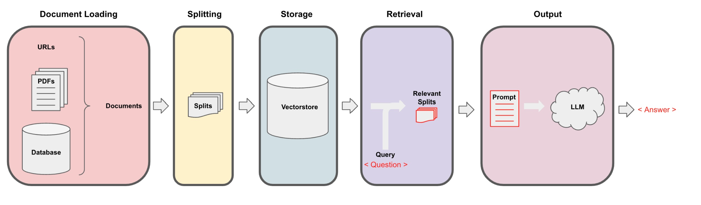

# Building LLM powered applications using langchain

The objective of the workshop is to 

* Cover basics of LLM
* Cover langchain components
    - Document Loaders and Vector Database integrations
    - Text Splitters and Retriver
    - Various types of Chains
    - Creating Custom LLM ( integration of custom LLM )

* Brief introduction to Agents

* Build "Question & Answer Over documents" using above concepts
  
* Brief discussion about other usecases
* Dos and Don'ts when developing LLM based applications in langchan

